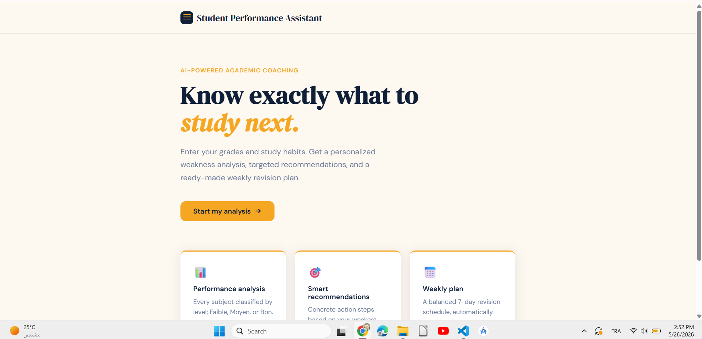
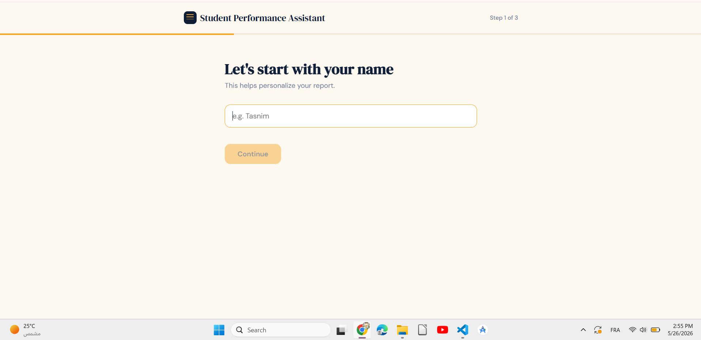
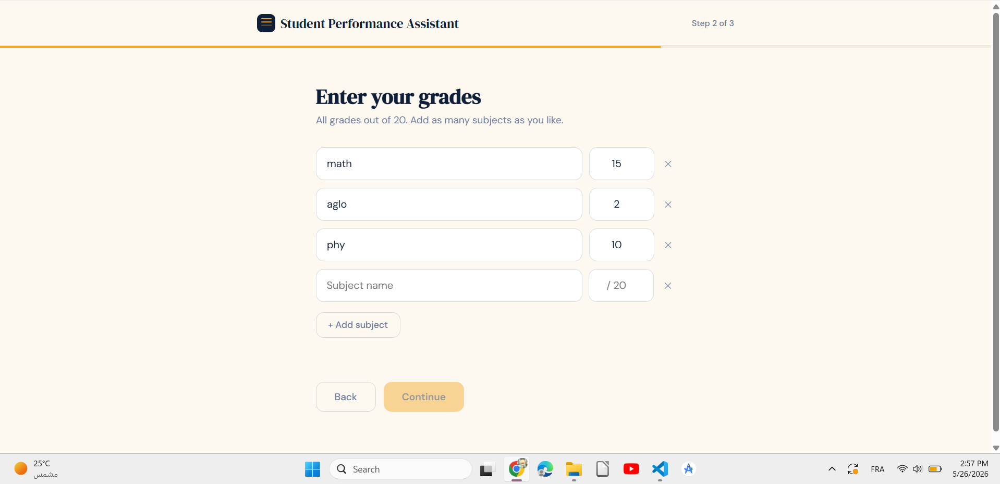
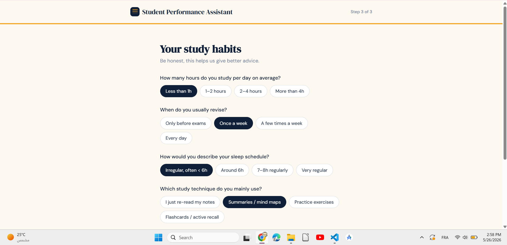
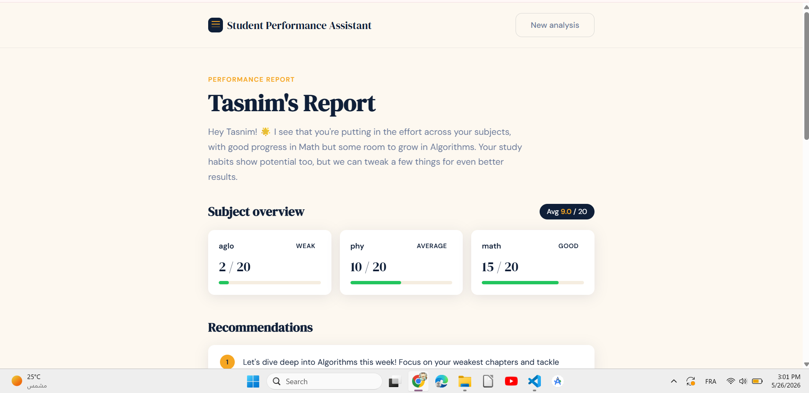
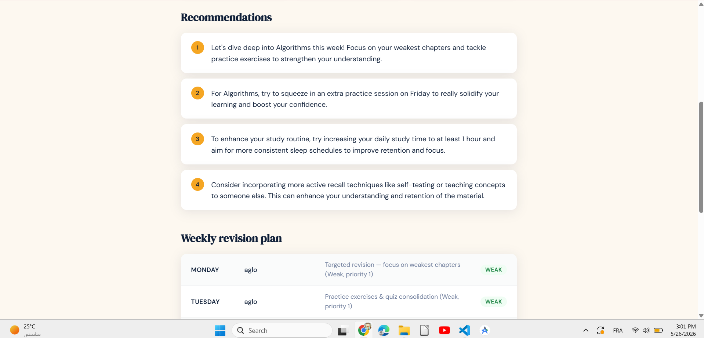
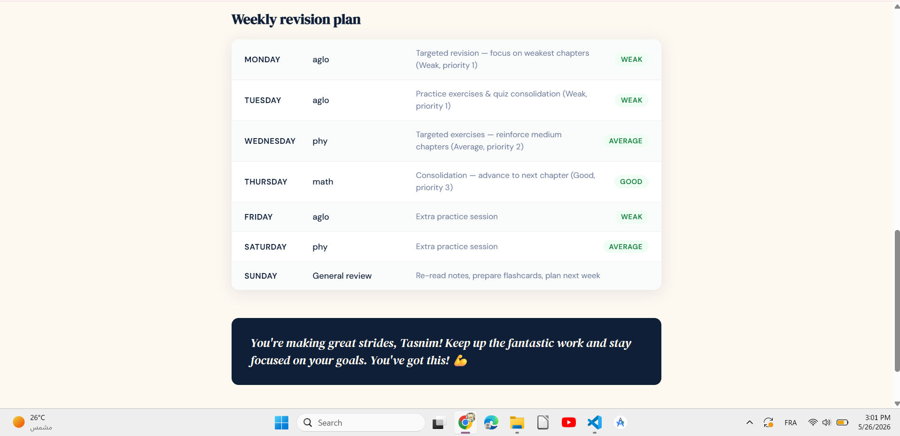

# 🎓 Student Performance Assistant

> Know your weaknesses. Fix your habits. Let AI build your study plan.

A full-stack **LLM-powered** academic coaching web application that analyzes a student's grades and study habits, then generates a fully personalized performance report including AI-written recommendations, a 7-day revision schedule, motivation, and warnings when academic risk is detected.

---

## 🤖 How AI Powers This App

This project combines two intelligence layers:

**1. Rule-Based Classification Engine (Python)**
Grades are automatically classified into performance levels no LLM needed for this step:
- 🔴 **Weak** : grade < 10/20 → highest revision priority
- 🟡 **Average** : grade 10–13/20 → needs reinforcement
- 🟢 **Good** : grade ≥ 14/20 → consolidation focus

A 7-day revision plan is then generated programmatically, assigning days based on priority level.

**2. LLM Text Generation (GPT-3.5 Turbo via OpenRouter)**
The classified data and generated plan are passed to GPT-3.5 Turbo, which writes the human-facing content:
- 📋 **Personalized summary** : addresses the student by name, references their actual subjects
- ✅ **4 concrete recommendations** : 2 for weak subjects, 1 for study habits, 1 strategy tip
- ⚠️ **Warning** : only triggered if average < 9 or habits reveal serious risk patterns
- 💪 **Motivation** : one punchy closing message to energize the student

---

## ✨ Features

- 👤 **Personalized by name** : the AI addresses the student directly
- 📊 **Grade input** : add any number of subjects with grades out of 20
- 🧠 **Study habits quiz** : 4 questions covering study hours, revision frequency, sleep, and techniques
- 🔢 **Rule-based classifier** : instant subject classification without LLM cost
- 🗓️ **Auto-generated 7-day plan** : weak subjects get more days, Sunday is always a general review
- 🤖 **LLM-powered report** : GPT-3.5 Turbo writes warm, specific, actionable feedback
- ⚠️ **Smart warnings** : only shown when genuinely needed, not by default

---

## 📸 Screenshots

### 🏠 Home


### 👤 Enter Your Name


### 📊 Enter Grades


### 🧠 Study Habits Quiz


### 📋 AI Report
| Grade Analysis | Recommendations | Schedule & Motivation |
|---------------|-----------------|----------------------|
|  |  |  |

---

## 🏗️ Architecture

```
student-performance-assistant/
├── main.py                  # FastAPI backend
│   ├── /analyze             # Main endpoint  classification + LLM report
│   ├── /health              # Health check
│   └── /sample-request      # Example request shape for frontend devs
├── frontend/
│   └── src/
│       └── pages/
│           ├── Home.jsx     # Landing + name input
│           ├── Quiz.jsx     # Grades + study habits (3-step flow)
│           └── Report.jsx   # Full AI report display
├── screenshots/
└── .env                     # API keys (not included)
```

---

## 🔬 How It Works

1. User enters their name
2. User adds subjects and grades (out of 20)
3. User answers 4 study habit questions
4. **Rule-based engine** classifies each subject and builds a 7-day revision plan
5. Classified data + habits are sent to **GPT-3.5 Turbo via OpenRouter**
6. LLM generates a warm, personalized report (summary, recommendations, warning, motivation)
7. Full report displayed in 3 sections: Grade Analysis → Recommendations → Schedule + Motivation

---

## 🚀 Getting Started

### Prerequisites
- Python 3.10+
- Node.js 18+
- OpenRouter API key (free at [openrouter.ai](https://openrouter.ai))

### Backend

```bash
python -m venv venv
source venv/bin/activate  # Windows: venv\Scripts\activate
pip install fastapi uvicorn python-dotenv requests pydantic
uvicorn main:app --reload
```

### Frontend

```bash
cd frontend
npm install
npm run dev
```

### Environment Variables

Create a `.env` file in the root:

```
OPENROUTER_API_KEY=your_openrouter_key
```

---

## 🌐 API Endpoints

| Method | Endpoint | Description |
|--------|----------|-------------|
| POST | `/analyze` | Full analysis — classification + LLM report |
| GET | `/health` | Service health check |
| GET | `/sample-request` | Example request body |

---

## 🛠️ Tech Stack

| Layer | Technology |
|-------|-----------|
| Frontend | React + Vite |
| Backend | FastAPI (Python) |
| LLM | GPT-3.5 Turbo via OpenRouter API |
| Classification | Custom rule-based engine (Python) |
| Planning | Algorithmic 7-day scheduler (Python) |
| Environment | Python venv |

---

## 👤 Author

**Sakni Tasnim**  
Telecommunications & Computer Engineering Student  
🔗 [GitHub](https://github.com/Sakni-Tasnim) • [LinkedIn](https://www.linkedin.com/in/sakni-tasnim-0bb856389)

---

## 📄 License

Feel free to use, modify, and build on this project.
